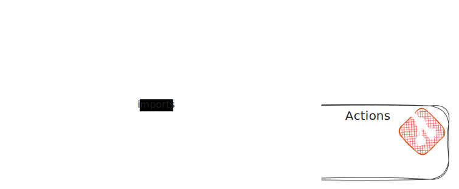

# 3. auth0-action-management

Date: 2025-01-15

## Status

Accepted

## Context

The project uses Auth0 [actions](https://auth0.com/docs/customize/actions) to interact with downstream systems in the user registration journey. Actions need access to secrets, and any solution should also explore how developers manage secrets with the action's NodeJS code.

Engineers must code actions in NodeJS, the only available language. Action functions can use public NPM packages; they can't use private NPM packages.

When managing actions, you must decide whether to use the dashboard or the Auth0 [API](https://auth0.com/docs/api/management/v2/actions/post-action). The dashboard provides a version control system (VCS), code editor, panels for managing secrets and draft/deployment mechanism. All the functionality available in the dashboard is also available through the API, and a terraform [module](https://registry.terraform.io/providers/auth0/auth0/latest/docs/resources/action) is available.

## Decision

We will use Terraform to manage the action 'scaffold'  alongside the tenant's configuration. The function body will live in a separate repository.




The action scaffold will consist of everything except the function body. It includes secrets, triggers, and dependencies. To retreive data from an external resource we should be able to use terraforms http datasource:

```tf
data "http" "my_file" {
  url = var.my_file_url

  request_headers = {
    "Authorization" = "Bearer TOKEN" # (if you need it)
  }
}
```

### Creating an action
1. Create the action scaffold in the IaC repo.
2. Create the action in the actions repo.
3. Apply the terraform code.

### Updating an action
1. Develop the action.
2. Update any npm dependencies in the IaC repo.
3. Apply the terraform code.

## Consequences

Managing the actions through Terraform config will bring the advantages of IaC: consistency, repeatability, version control, and traceability. Splitting the scaffold and the function body will allow the actions to be developed in a specific environment, leading to an improved developer experience and allowing the functions to be unit tested.

This change will make the deployment process more complex. As a team, we should seek to mitigate this through precise documentation and CI tooling, such as automated workflows and hooks, where appropriate.
