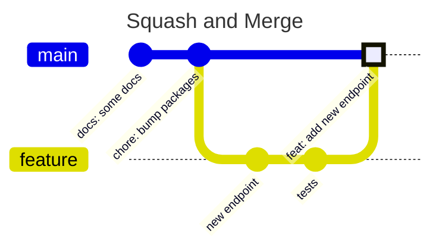
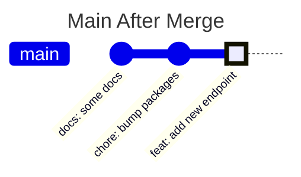

# 5. Pull request merges

Date: 2025-01-21

## Status

Accepted

Amends [2. git-commit-conventions](0002-git-commit-conventions.md)

## Context

The team needs to pick a merge strategy for pull requests. Important considerations include whether or not to keep commits, rewrite the main branch and create a new commit. Our choices impact [2. git-commit-conventions](0002-git-commit-conventions.md) as merge commits affect the git history.

## Decision

### Summary:
1. We will squash and merge commits.
2. We will enforce conventional commits on the merging commit.
3. Squashed commits do not need to follow conventional commits (amends [2. git-commit-conventions](0002-git-commit-conventions.md))


### We will squash and merge commits.

> *When you select the Squash and merge option on a pull request, the pull request's commits are squashed into a single commit. Instead of seeing all of a contributor's individual commits from a topic branch, the commits are combined into one commit and merged into the default branch.*
>
> *[github](https://docs.github.com/en/pull-requests/collaborating-with-pull-requests/incorporating-changes-from-a-pull-request/about-pull-request-merges)*

The diagram below depicts this approach:




### We will enforce conventional commits on the merging commit.

On merge, a pull request's merging commit should follow conventional commits as laid out in ADR 2. An advantage of squashing and merging in GitHub is that the commit that goes into the main branch can be changed. We will set the repository settings to always use the PR title.

Given the commit `docs: update README.md with new command usage` in main, there will be a closed pull request called `docs: update README.md with new command usage`, and within the description would be a list of squashed commits. Altogether, the commit would look like this:

```
commit eba43dd272de1c34611605b7382899e1
Merge: ecaf44 7c97a5
Author: Elvis Presley <pataruco@users.noreply.github.com>
Date:   Mon Jan 01 01:01:01 2025 +0000

    docs: update README.md with new command usage

    add linting rules
```

### Squashed commits do not need to follow conventional commits
The author can decide the format of commits used inside the pull request. They will be squashed and merged and only be in the git history as a description of the merging commit.

In the example given above, the squashed commit would have been `add linting rules`.

## Consequences

To enforce this, we must change the repository's GitHub settings or find another way to implement policy through workflows.

The commit history will be linear and follow conventional commits. Also, every commit will have a pull request linked to it with the same name.
