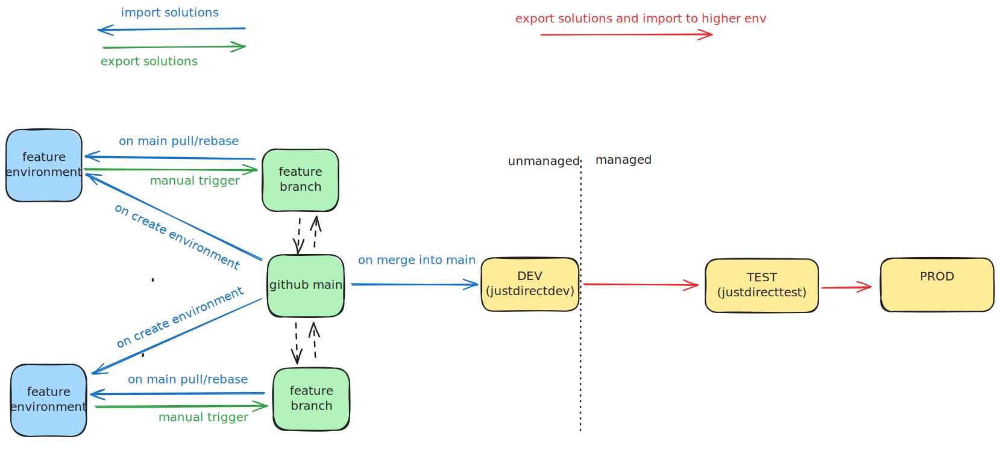

# 8. Dynamics CI/CD pipeline workflows

Date: 2025-02-19

## Status

Proposed

## Context

We need a pipeline and associated Github workflows that can support development of Power Apps/Dynamics 365 solutions and deploying those solutions to the DEV, TEST and PROD Power Platform environments.

### Key concepts
- **Solutions are groups of objects in Power Platform**. An object can be a table, a Custom API, a binary plugin etc. Solutions hold references to those objects. An object, for example a table, can be referenced by more than one solution. This means that modifying that object in an environment affects all the solutions that reference that object.
Exporting a solution creates a zip file that contains xml files that define those references, as well as the objects.

- **Solutions can be managed or unmanaged**. Unmanaged solutions are editable, and can be thought of as the equivalent of "source code". Managed solutions are immutable, and can be thought of as "binaries". The only way to apply changes to a managed solutions is by using "patches" (hotfixes). We want solutions from the TEST environment and up to be managed, so that any changes to them go first through the git repository.

- **A solution can be "updated" or "upgraded"**. Updating a solution applies changes to it but does not delete an object it no longer references. Upgrading a solution updates it but also deletes any objects that are no longer referenced. We usually want to do "upgrades" so that the solution in any shared environment reflects the state in our repository. We want "updates" if the roll out of a change in our solution also needs a data migration and a delayed clean up after the migration (so we cannot for example delete an object that is no longer referenced before moving the data into our new object).

## Decision

Github Actions will be used for the pipeline. The development flow of a Dynamics feature is expected to be:

- The developer spins up a feature environment and imports all existing solutions from the git repository to it. This will also be used for testing deployments in a PR.

- After developing the feature, the developer exports the solution changes (updates to existing solutions or creation of new ones) to a git branch for review.

- After code review the solutions that changed will be deployed (imported) as "unmanaged" to DEV.

- The solutions will then be progressively deployed to other environments (TEST, PROD) as "managed".

We will create GitHub workflows for carrying out the following tasks:

- A workflow to spin up a feature environment and import all solutions from the git repository to it.

- A workflow to export unmanaged solutions from a personal dev environment and create branches for creating PR's and commiting the solutions to the repository (green arrows).

- A workflow to import and publish solutions to any environment once they are committed to the repository (blue arrows). This workflow will be used to
import solutions from the github repository to DEV or a feature environment.

- A workflow to export solutions from an environment as managed and deploy them to the next environment (red arrows). This workflow is intended to
propagate solutions from DEV to TEST and from TEST to PROD.

- A workflow to clean up the feature environment once the feature is merged to main.

## Consequences

The source of truth is the github repository. Developers can still use the Power Apps UI to create their solutions and
use the first Github workflow to commit to the repository.

An App registration needs to be created in Entra for importing/exporting solutions with the following permissions:

- Dynamics CRM, delegated permissions, `user_impersonation`
- PowerApps Runtime Service, delegated permissions, `user_impersonation`
- PowerApps-Advisor, delegated permissions, `Analysis.All`

with a secret than will be added to the Github repository's secrets so that the workflows can access the environments.

An App User (Service Principal) needs to also be created with `System administrator` security role using this app registration in each Power Platform environment that
the Github workflows will be accessing.

(source: https://learn.microsoft.com/en-us/power-platform/alm/tutorials/github-actions-start) 

Additionally, an App registration with Power Platform admin rights will be used in the Github workflow that creates/deletes
feature environments.