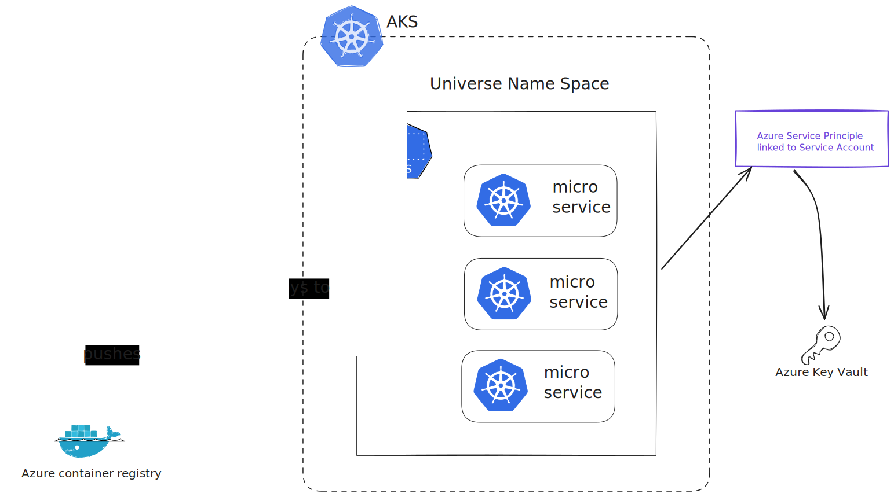
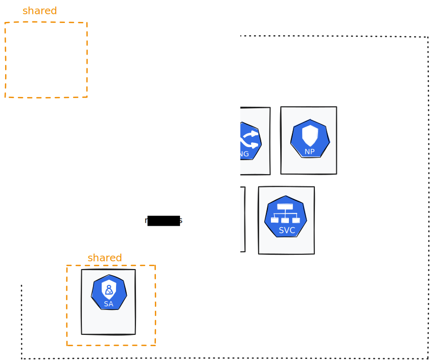
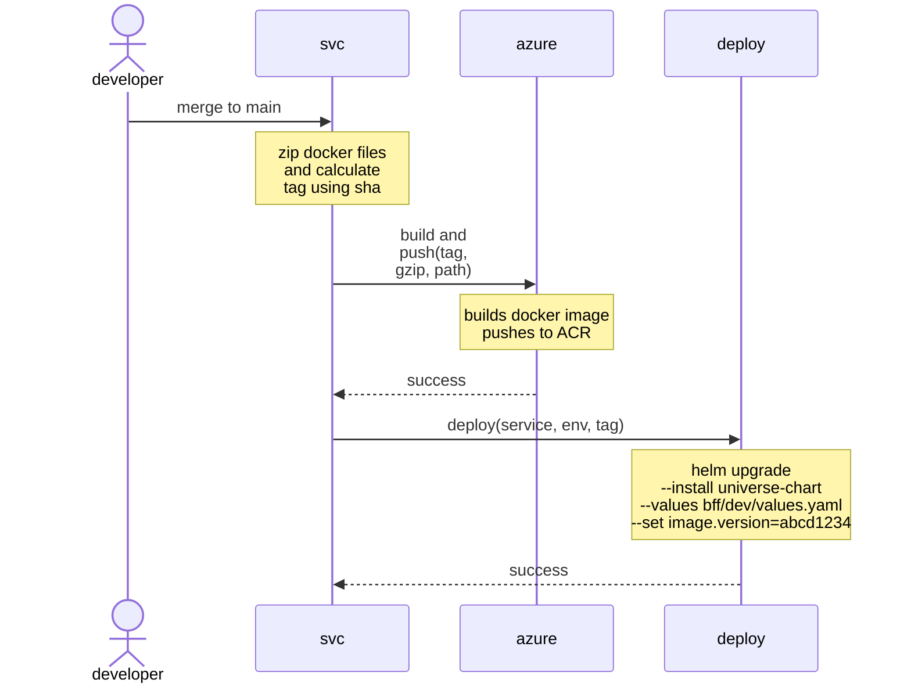
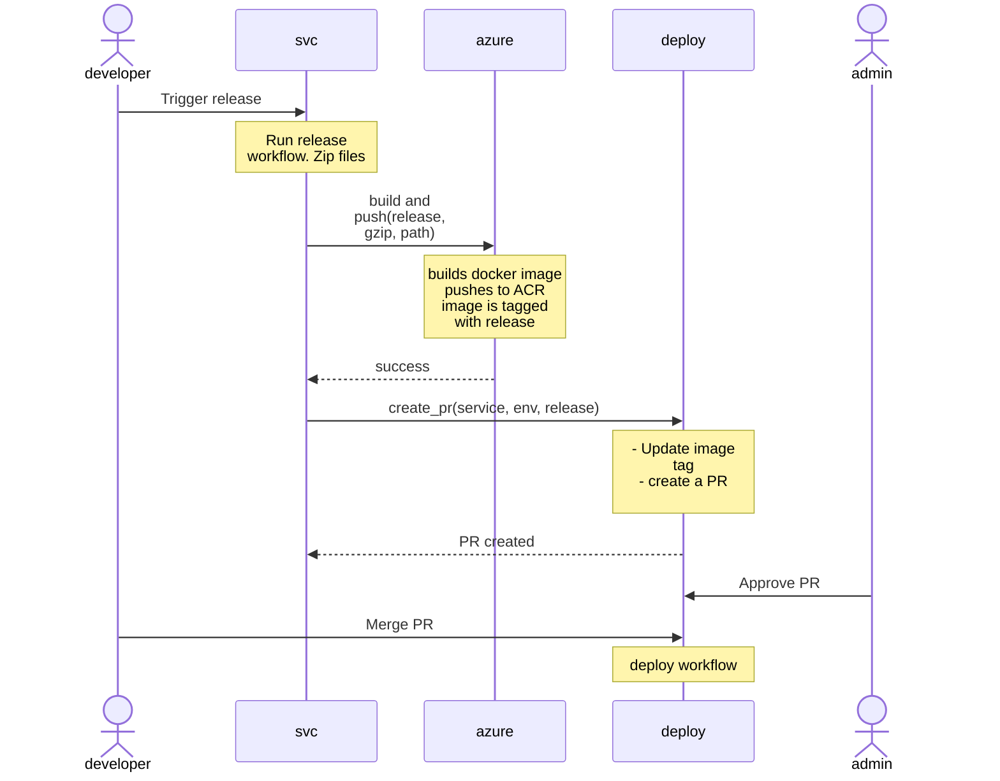

# 9. micro services deployment

Date: 2025-02-17

## Status

Accepted

## Context

The team needs a mechanism for deploying microservices. We aim to share deployment workflows and code across engineering teams involved in the universe project.

We have reached an agreement with the platform team and other engineering teams in the universe domain on the following tactical points regarding the deployment of Azure Kubernetes Service (AKS) microservices:
- All universe services will deploy into one namespace
- A workload identity linked to one Service Account links resources within the cluster to the Azure cloud.
- All universe teams will share the same self-hosted GitHub runners for deployment.
- All universe teams will use the same service principal to deploy to AKS.




## Decision

For deploying microservice, we propose:
- Using Helm for deployments and having one shared service chart
- We will deploy the same Helm chart multiple times with different release names and values.
- Engineers will store the chart and its associated values in a repository named "universe-deploy."
- We will use a GitHub action for deployment that lives in the [universe-deploy repository](https://github.com/Just-Universe/universe-deploy).
- The other repositories will call the deploy GitHub action.

Now, we will explain in more detail how the helm-deploy repository will be organised and provide some example release flows.

### Helm Chart Organisation
The helm chart will contain the following standard Kubernetes resources:
- Ingress
- Deployment
- Horizontal Pod Autoscaling
- Service Account
- Service
- Network Policy: A cluster-level network policy blocks all ingress and egress traffic, and this network policy overrides those rules.
- _Secret_: Created by the secret provider (see below).

In addition to these resources, we will also include a custom resource definition (CRD) to provide secrets. The current CRDs we intend to use are:
- Secrets Provider: Injects Secrets from Azure Key Vault into the namespace

The below diagram is visual representation of the above resources:



### Universe Deploy Repository
The universe deploy repository will be laid out like this:
```
.
├── service-chart/
│   ├── Chart.yml
│   ├── Values.yml
│   └── templates/
│       ├── ingress.yml
│       ├── deployment.yml
│       ├── hpa.yml
│       ├── svc.yml
│       ├── sa.yml
│       ├── secret_provider.yml
│       ├── np.yml
│       └── _helpers.tpl
└── env/
    ├── micro-service/
    │   ├── dev/
    │   │   └── values.yml
    │   └── prod/
    │       └── values.yml
    └── another-micro-service/
        ├── dev/
        │   └── values.yml
        └── prod/
            └── values.yml
```
To do a deployment the deploy job will call
```sh
helm install <release-name> service-chart/ -f <release-name>/<env>/values.yml
```
Some information inside the environment values files will be sensitive (but not secret). To protect it, we will use GitHub environment variables.

### Continous Deployment
**Automatic Dev Releases**
- Triggers on merging to the main branch.
- `image.tag` is passed as a workflow argument



**Deploying to Non Dev Environments**
- The current version of testing, uat and prod are stored in the yaml.
- Higher environments need approval.
- `image.tag` is set in the values.



## Consequences

Sharing deployment workflows and code across universe teams means we will standardise release flows across the universe software estate. Independently releasing services makes deploying services more manageable, but it also complicates coordinating releases across services.
