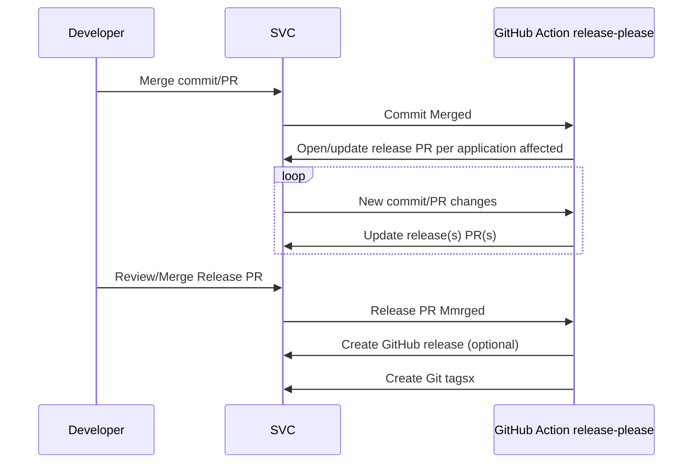

# 10. Release Strategy: Google Release-Please in Monorepo

Date: 2025-03-05

## Status

Proposed

## Context

We are managing a monorepo containing multiple independent applications.

We want an automated, reliable, and scalable release strategy to handle the complexity of our monorepo. We are considering leveraging Google's [`release-please`][release-please] and the [`release-please-action` GitHub Action][release-please-action] to automate versioning, changelog generation, and release management for each application within the monorepo.

## Decision

We will implement Google's `release-please` and the `release-please-action` GitHub Action as our release strategy for our monorepo.

We are creating a release please configuration file (`release-please-config.json`) in the root of the repo

```json
{
  "always-update": true,
  "draft-pull-request": true,
  "packages": {
    "applications/api": {
      "changelog-path": "CHANGELOG.md",
      "versioning": "default",
      "release-type": "simple",
      "package-name": "customer-api"
    },
    "applications/nba": {
      "changelog-path": "CHANGELOG.md",
      "release-type": "simple",
      "versioning": "default",
      "package-name": "next-best-action-api"
    }
  },
  "pull-request-title-pattern": "chore: release${component} ${version}",
  "pull-request-header": "🚀 Release",
  "$schema": "https://raw.githubusercontent.com/googleapis/release-please/main/schemas/config.json",
  "separate-pull-requests": true
}
```

This configuration enables [`release-please`][release-please] to detect changes within each application's directory and once [`release-please-action` GitHub Action][release-please-action] is trigger upon merging pull requests will automate the creation of GitHub releases with proper git tags and release notes.

### Release workflow



## Consequences

- Reduces manual effort and eliminates human error in versioning and changelog maintenance.
- Ensures consistent and predictable release cycles across all applications.
- Streamlines the release process, making managing releases for multiple applications within a monorepo easier.
- Automatically generated changelogs provide clear visibility into changes included in each release.
- Automating the release process reduces the time required to deploy new versions.
- Each application can be released independently.

[release-please]: https://github.com/googleapis/release-please
[release-please-action]: https://github.com/googleapis/release-please-action
