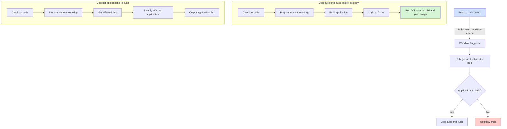

# Continous integration | Continous deployment (CI/CD)

For CI/CD are using [Nx](https://nx.dev/getting-started/intro) as monorepo tooling in tandem with GitHub Actions

For GitHub Actions runners, we have three types:

- `ubuntu-latest`: which runs as shared GitHub runner with the Ubuntu distro
- `self-hosted-app`: a self-hosted runner, generally used by the app team
- `self-hosted-cdp`: which is a self-hosted runner, normally used by the CDP team, you can check the base image on [`docs/self-hosted-runners/cdp-team.dockerfile`](docs/self-hosted-runners/cdp-team.dockerfile)

You can check the list of available self-hosted runners [here](https://github.com/Just-Universe/universe-customer-data-platform/settings/actions/runners)

## Continous integration

We created a GitHub two GitHub workflows.

### `pr`

It runs test and lint on files affected on the pull request.

### `integration`

I run end-to-end tests on the libraries and applications affected by merge to the `main` branch.

## Continous deployment

We created one file

### `build-and-push`

Using `self-hosted-cdp`eds to be build and if it's so it will parallelised each build image and push Azure container registry

